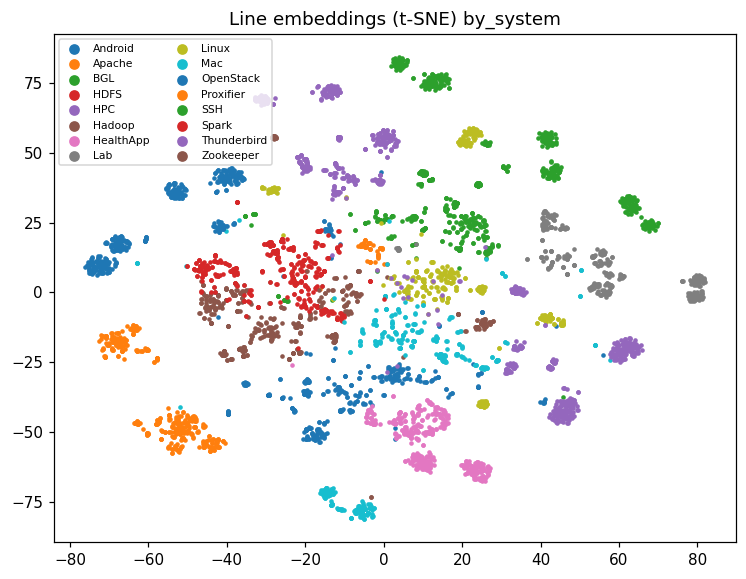
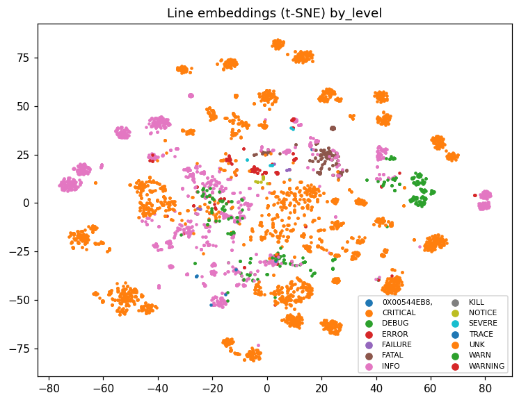

# Embedding sanity report

## Nearest neighbours

Automatic judge on 300 random lines: the nearest neighbour shares the query's Drain3 template in **68.0%** of cases; mean fraction of the 5 nearest neighbours sharing it: 62.5%. (Gate: >= 90% of spot checks. Lines here are *distinct masked strings*, so a neighbour with a different string but the same Drain3 template is the meaningful signal.)

Examples:

- **BGL**: `ciod: In packet from node <NUM> (<LOC>-Ne-C:J11-U11), message code 2 is not <NUM> or <NUM>`
  - NN1: `ciod: In packet from node <NUM> (<LOC>-Ne-C:J07-U11), message code 2 is not <NUM> or <NUM>`
- **BGL**: `Target=<URL> Message=ScomError`
  - NN1: `Target=<URL> Message=Pll failed to lock`
- **BGL**: `r00=<HEX> r01=<HEX> r02=<HEX> r03=<HEX>`
  - NN1: `r04=<HEX> r05=<HEX> r06=<HEX> r07=<HEX>`
- **BGL**: `ciod: In packet from node <NUM> (<LOC>-Nf-C:J03-U01), message code 2 is not <NUM> or <NUM>`
  - NN1: `ciod: In packet from node <NUM> (<LOC>-Nf-C:J04-U01), message code 2 is not <NUM> or <NUM>`
- **BGL**: `<NUM> torus receiver z+ input pipe error(s) (dcr <HEX>) detected and corrected over <DURAT`
  - NN1: `<NUM> torus receiver y+ input pipe error(s) (dcr <HEX>) detected and corrected over <DURAT`
- **BGL**: `ciod: pollControlDescriptors: Detected the debugger died.`
  - NN1: `ciod: for node <NUM>, incomplete data written to core file core.<NUM>`

## t-SNE




## Linear probe on BGL line labels

Trained on lines seen in the train split, tested on lines whose masked text first appears later (template lookup impossible).

```json
{
  "n_train": 755,
  "n_test_novel": 426,
  "test_pos_rate": 0.07042253521126761,
  "encoder": {
    "pr_auc": 0.47787136867728974,
    "f1": 0.4864864864864865
  },
  "tfidf": {
    "pr_auc": 0.6486285045997676,
    "f1": 0.5862068965517241
  }
}
```
